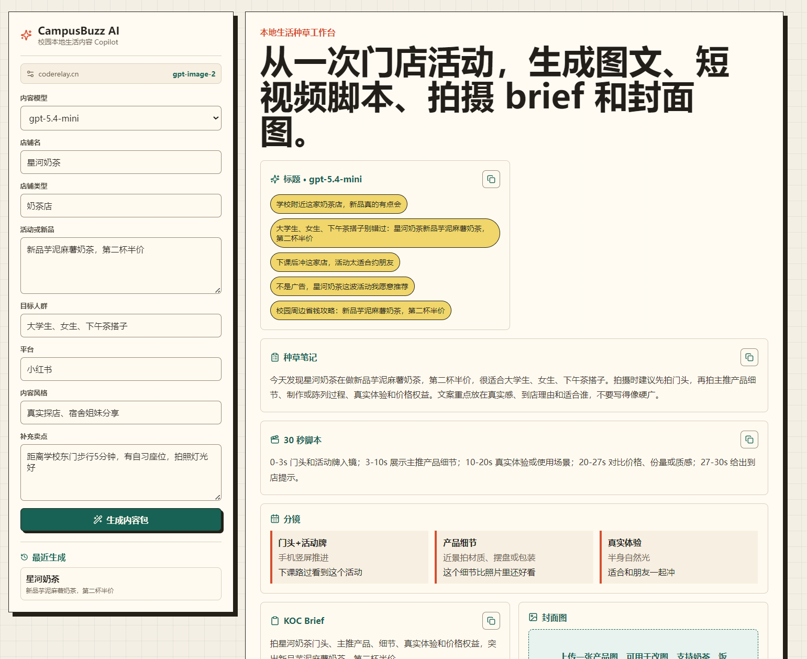
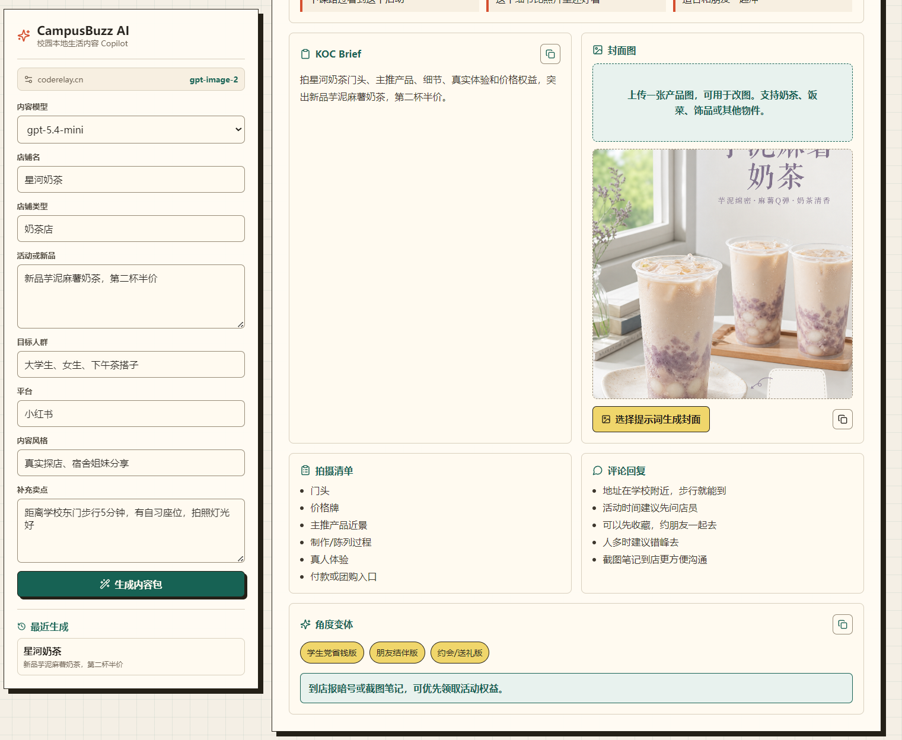

<div align="center">


# **校园周边小商家的本地生活内容 AI Copilot**--CampusBuzz AI

把一次门店活动、新品信息或产品图片，快速转化为小红书/抖音可发布的种草内容、短视频脚本、拍摄 brief 和封面图。


</div>

## 项目预览

### 快速使用：https://campusbuzz.jiangai.space/

### 内容生成工作台



### 内容包与封面图工作流



### AI 生成封面图


## 项目介绍

CampusBuzz AI 是一个面向校园周边小商家的轻量 AI 内容工具。

很多学校附近的奶茶店、餐饮店、美甲店、饰品店、健身房、桌游店都知道要做小红书、抖音和本地生活团购，但实际运营时常遇到几个问题：

- 不知道怎么把活动写成像真实种草的内容
- 不会设计短视频脚本和拍摄分镜
- 和学生 KOC 沟通成本高
- 产品图不够好看，封面图不够吸引人
- 请代运营成本高，自己发内容又不稳定

CampusBuzz AI 的目标是：让小商家只需要输入一次门店活动信息，就能得到一套可以直接执行的内容生产方案。

## 核心功能

| 功能            | 描述                                                         |
| --------------- | ------------------------------------------------------------ |
| 内容包生成      | 根据店铺名、店铺类型、活动、新品、目标人群和内容风格，生成完整种草内容包。 |
| 小红书/抖音标题 | 生成适合种草平台的标题，强调真实感、场景感和转化点。         |
| 种草笔记        | 生成可发布的本地生活种草笔记，避免生硬广告腔。               |
| 30 秒短视频脚本 | 输出带时间轴的短视频脚本，包括画面安排、字幕和口播建议。     |
| 拍摄分镜        | 生成门头、产品细节、制作过程、真人体验、价格权益等镜头规划。 |
| KOC Brief       | 自动整理给学生探店博主的拍摄需求，减少商家和博主反复沟通。   |
| 评论区回复      | 生成适合种草内容的评论回复话术，方便商家维护互动。           |
| 封面图提示词    | 根据当前店铺和产品自动生成封面图 prompt。                    |
| AI 图片生成     | 支持使用 `gpt-image-2` 生成小红书风格封面图。                |
| 上传图片改图    | 支持上传奶茶、饭菜、饰品或其他产品图片，并基于提示词进行精修、场景化或商业质感增强。 |
| 提示词卡片      | 内置“精修种草封面”“商业质感大片”“真实探店增强”三种图片提示词。 |
| 自定义提示词    | 用户可以在内置模板基础上自由修改图片生成或改图要求。         |
| 品牌约束        | 上传图片中如果包含无关品牌、店名、Logo 或包装文字，系统会提示模型删除或替换为当前店铺名。 |
| 历史记录        | 浏览器本地保留最近生成的内容，方便回看和复用。               |
| 一键复制        | 支持复制标题、笔记、脚本、KOC brief 和完整内容包。           |

## 图片提示词模板

CampusBuzz AI 内置 3 种图片生成/改图方向：

### 1. 精修种草封面

适合小红书首图。保留主体真实样子，同时提升光线、构图、色彩和质感。

适用场景：

- 奶茶新品
- 饭菜套餐
- 饰品细节
- 店内陈列

### 2. 商业质感大片

适合活动海报、团购页、商家宣传图。画面更精致，商业感更强。

适用场景：

- 新品推广
- 第二杯半价
- 套餐团购
- 节日活动

### 3. 真实探店增强

保留学生博主真实探店感，不做过度商业化处理，只让照片更干净、更好看。

适用场景：

- 学生 KOC 探店
- 宿舍姐妹分享
- 自习后顺路购买
- 校园周边真实推荐

## 适用用户

- 校园附近奶茶店、餐饮店、美甲店、饰品店、健身房、桌游店等小商家
- 想做小红书/抖音但缺少内容运营能力的本地商户
- 接商单的学生 KOC、探店博主、校园代运营团队
- 想验证本地生活内容 AI 机会的早期创业项目

## 技术栈

- 前端：React、Vite、lucide-react、Nginx
- 后端：FastAPI、httpx、Pydantic
- AI 接口：OpenAI-compatible API
- 部署：Docker Compose

## 环境变量

复制 `.env.example` 为 `.env`，并填写你的模型中转站配置：

```env
AI_BASE_URL=https://your-relay.example.com/v1
AI_API_KEY=replace-with-your-relay-key
AI_MODEL=gpt-5.4-mini
IMAGE_MODEL=gpt-image-2
MODEL_OPTIONS=gpt-5.4-mini,gpt-5.4,gpt-5.2,gpt-5.3-codex
```

也兼容以下历史命名：

```env
RERANK_BASE_URL=https://your-relay.example.com/v1
RERANK_API_KEY=replace-with-your-relay-key
AI_MODEL=gpt-5.4-mini
IMAGE_MODEL=gpt-image-2
```

## Docker 一键部署

确保已经安装 Docker 和 Docker Compose，然后在项目根目录执行：

```bash
docker compose up -d --build
```

默认访问地址：

```text
http://localhost:8080
```

后端健康检查：

```text
http://localhost:8000/api/health
```

如果 `8080` 端口被占用，可以修改 `docker-compose.yml`：

```yaml
frontend:
  ports:
    - "8090:80"
```

然后重新启动：

```bash
docker compose up -d --build
```

## 常用命令

查看容器状态：

```bash
docker compose ps
```

查看日志：

```bash
docker compose logs -f
```

停止服务：

```bash
docker compose down
```

重新构建并启动：

```bash
docker compose up -d --build
```

## 本地开发

后端：

```bash
cd backend
pip install -r requirements.txt
uvicorn main:app --reload --port 8000
```

前端：

```bash
cd frontend
npm install
npm run dev
```

## 项目结构

```text
.
├── backend
│   ├── ai_client.py
│   ├── main.py
│   ├── requirements.txt
│   └── schemas.py
├── frontend
│   ├── src
│   ├── Dockerfile
│   ├── nginx.conf
│   └── package.json
├── docs
│   └── images
├── docker-compose.yml
├── .env.example
└── README.md
```

## 注意事项

- `.env` 中包含 API key，不要提交到 GitHub。
- 图片生成和图片改图通常比文本生成慢，可能需要几十秒。
- 项目内前端 Nginx 已设置较长的代理超时时间，适合图片生成和上传改图场景。

## 社区支持

学 AI，上 L 站：[linux.do/](https://linux.do/)

